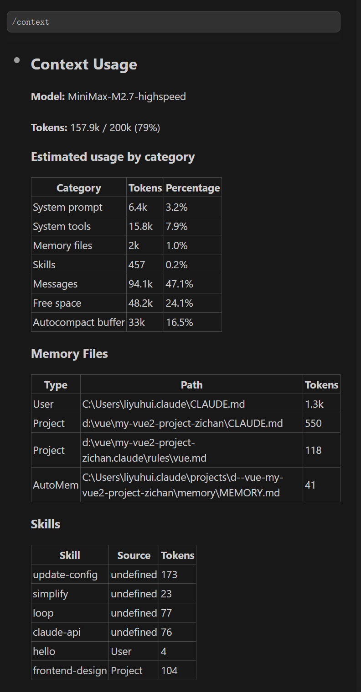
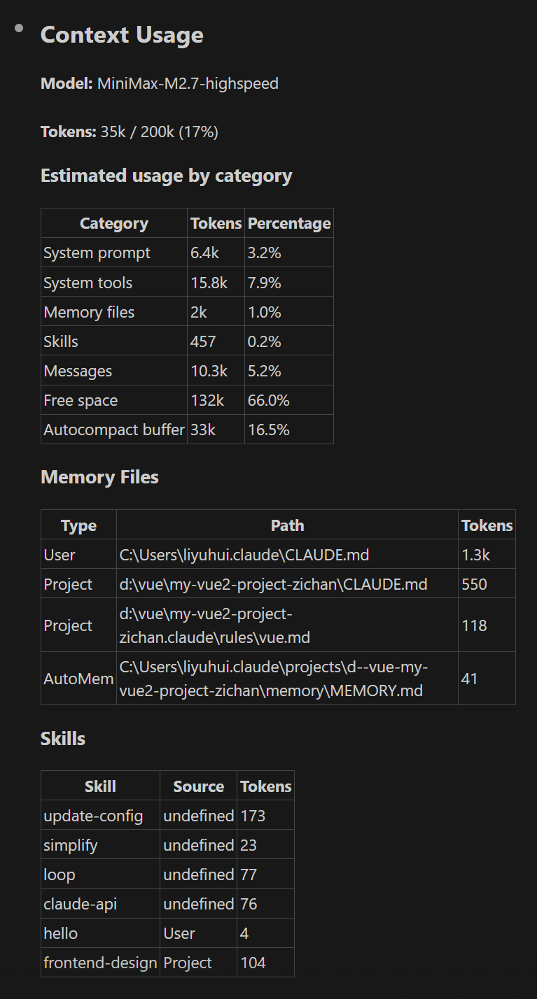

# Claude Code经验总结（VSCode + Claude Code插件）

## 项目结构

```
project
│
├─ CLAUDE.md
│
└─ .claude
   │
   ├─ agents
   │   └─ code-reviewer.md
   │   ...
   │
   ├─ rules
   │   ├─ code-style.md
   │   ├─ coding-style.md
   │   └─ security.md
   │   ...
   │
   └─ skills
       └─ frontend-design
          └─ SKILL.md
       ...
```

打开项目时 Claude 会自动读取 .claude 下的内容

## CLAUDE.md 项目说明

在对话框执行 /init，Claude 会分析代码库，自动生成包含项目概述、技术栈、目录结构、常用命令的初始文件。需要手动打磨，更贴合实际业务，精简在 200 行以内。

CLAUDE.md 其实有一套层级系统，不同位置的文件覆盖的范围不一样：

1. 全局级别：C:/Users/用户名/.claude/CLAUDE.md。

2. 项目根目录：./CLAUDE.md。项目级规范。

3. 子目录：./src/code/xxx模块/CLAUDE.md。适合一个 Git 仓库里有多个独立模块的场景，可以各自维护。

4. 本地私有：CLAUDE.local.md。个人偏好。

这四个层级是可以叠加的。Claude 会按顺序全部读取，从全局到具体。

优先级：私有配置 > 子目录 > 根目录 > 全局

个人的开发习惯和工作流程等推荐添加到 CLAUDE.local.md，例如我加了这些配置可以避免流程不受控制（根据个人习惯设置）
```
## 用户工作流程规则

### 核心规则
1. **一步一步来**：没有用户允许，不准自行进入下一步
2. **严格遵守软件开发流程**
3. **彻底搞懂需求**：精确到界面每一个按钮的位置
4. **模块单独开发**：每个模块完成后先让用户测试，没问题再听安排；模块之间要正确衔接
5. **异议必问**：需求分析阶段有任何异议或不确定的地方，一定要立刻问用户，可以随时追问

**Why:** 用户希望完全掌控开发节奏，避免AI擅自推进；便于独立验证每个模块，理解偏差越早发现越好

**How to apply:** 每完成一步必须等待用户确认，才能进入下一步；需求必须细化到UI细节；模块完成后主动提测，衔接处预留接口；有疑问不自行猜测，主动向用户确认
```

## rules 项目级规则

保证项目长期稳定可控，把安全规范、编码规范、代码风格等底线固化下来，可以按照分类拆分成多个规则文件，放置在 .claude/rules 目录下。

## agents 制定专业角色

### 创建 agent

对话框打开 command 菜单，点击 Agents；或者 命令行启动 claude，输入 /agent。两者后续步骤相同，根据提示配置，完成后会在 .claude/agents 下生成一个例如 code-reviewer.md 的 agent 配置文件。也可以手动添加一个 agent 配置文件。

### 使用 agent

自动委托：当你的指令和 agent 的 description 字段高度匹配时，Claude Code 会自动调用它。

显式调用：请使用 code-reviewer 审查 XXX 代码。

## skills 固定的工作流程

在 .claude 下创建 [SKILL.md](.claude/skills/component-analyzer/SKILL.md)，重新加载项目后即可在对话框中输入，项目初始时只加载 skills 的 name 和 description，当 AI 判断需要用到某个 Skill 时，才会读取完整的 SKILL.md 和相关指令。

自动触发：当指令和 description 里的关键词或场景匹配时就会自动触发。

显式调用：/component-analyzer 请分析 xxx 组件和它的子组件之间的组件通信关系。

## MEMORY 自动记忆

Claude 在工作过程中会自主保存经验教训，内容涵盖：构建命令、调试见解、代码风格偏好、工作流习惯。它会自行判断哪些信息在未来对话中有复用价值，再决定是否保存。也可以主动要求 Claude 记住某些事情，需告诉 Claude："请记住变量名尽量不超过10个英文字母"，Claude 会将其保存到自动记忆中。

推荐定期整理 MEMORY，将可以规范化的内容转移到 CLAUDE.md/CLAUDE.local.md。

全局记忆：C:/Users/用户名/.claude/memory/MEMORY.md

项目记忆：C:/Users/用户名/.claude/projects/项目名/memory/MEMORY.md

### CLAUDE.md 于 MEMORY.md 的区别

| 文件 | 谁写 | 作用 | 优先级 |
|------|------|------|--------|
| CLAUDE.md | 你 / 团队 | 强制规范 | 中 |
| CLAUDE.local.md | 你 | 个人偏好 | 最高 |
| MEMORY.md | Claude / 你 | 项目上下文记忆 | 最低 |

## Claude Code 插件常用操作

### Alt+k 将鼠标选中的内容添加到对话框

### /compact

上下文的内容上限一般是 100k~200k token（1 token ≈ 1.5~2 个汉字）。
使用 **/context** 查看当前上下文。



/compact 会把冗长对话智能压缩成核心摘要，释放上下文空间，建议大于 85% 就压缩一下。



注意：重新进入会话就不显示之前的对话内容了，仅有一个摘要。之前的对话保存在本地文件，问AI要位置。

详细内容见 (https://claudecn.com/docs/claude-code/advanced/starter-kit/)